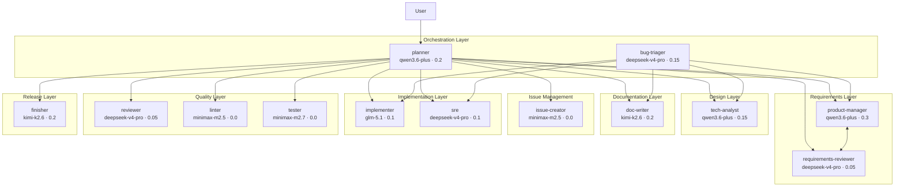
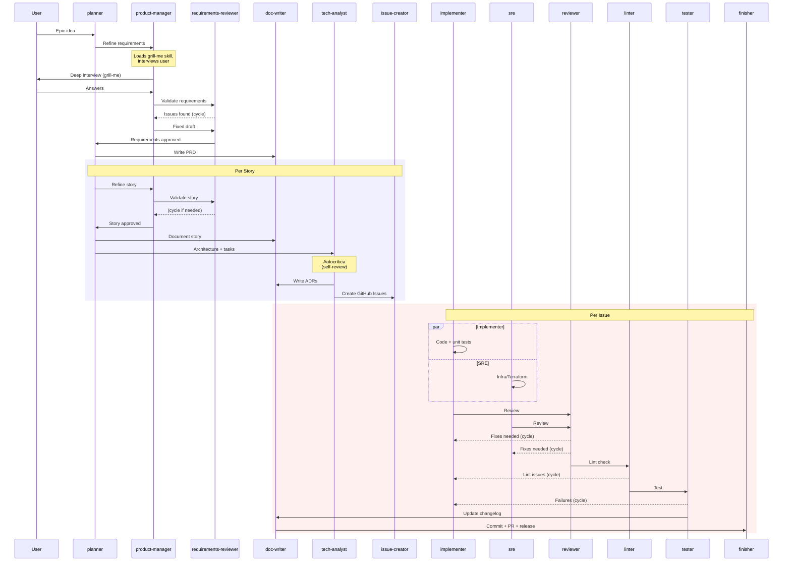
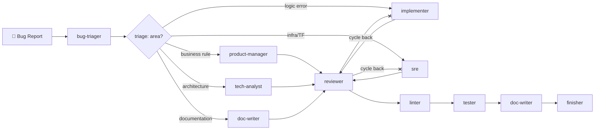
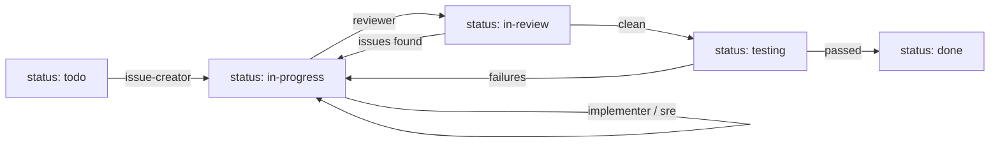

# orchestrated-squad

A multi-agent software engineering orchestration system supporting **opencode**, **VS Code Copilot Chat**, **Devin CLI**, and **Claude Code**. 13 specialized agents collaborate in a structured workflow to take a project from raw idea to shipped PR — with requirements refinement, architecture design, implementation, review, testing, and release.

## Architecture



## Complete Feature Workflow



## Bug Workflow



## Agents

### Orchestration

| Agent | Model | Temp | Role |
|-------|-------|------|------|
| **planner** | qwen3.6-plus | 0.2 | Pure orchestrator. Does NO work itself — only calls other agents. Never interviews the user directly. |
| **bug-triager** | deepseek-v4-pro | 0.15 | Analyzes bug reports, triages by severity/area, routes to correct agent(s). Uses adaptive routing based on root cause analysis. |

### Requirements

| Agent | Model | Temp | Role |
|-------|-------|------|------|
| **product-manager** | qwen3.6-plus | 0.3 | Interviews user using `grill-me` skill, writes structured requirements with acceptance criteria. Focuses on business value — never architecture. |
| **requirements-reviewer** | deepseek-v4-pro | 0.05 | Validates requirements for clarity, completeness, testability. Cycles with PM until approved. |

### Design

| Agent | Model | Temp | Role |
|-------|-------|------|------|
| **tech-analyst** | qwen3.6-plus | 0.15 | Defines architecture, tech stack, design patterns. Performs autocrítica (self-review) before output. Breaks work into ordered technical tasks. |

### Documentation

| Agent | Model | Temp | Role |
|-------|-------|------|------|
| **doc-writer** | kimi-k2.6 | 0.2 | Writes PRDs, story docs, ADRs (Architecture Decision Records), and changelog entries. |

### Issue Management

| Agent | Model | Temp | Role |
|-------|-------|------|------|
| **issue-creator** | minimax-m2.5 | 0.0 | Reads task breakdown from plan.md, creates one GitHub Issue per task using `gh api`. |

### Implementation

| Agent | Model | Temp | Role |
|-------|-------|------|------|
| **implementer** | glm-5.1 | 0.1 | Writes code + unit tests. Smallest change possible. Uses context7 for API verification. |
| **sre** | deepseek-v4-pro | 0.1 | Writes infrastructure as code (Terraform, Bicep, Docker, K8s). Parallel to implementer. |

### Quality

| Agent | Model | Temp | Role |
|-------|-------|------|------|
| **reviewer** | deepseek-v4-pro | 0.05 | Combined correctness + security review (double checklist). Reports issues, does not fix. |
| **linter** | minimax-m2.5 | 0.0 | Runs linter on changed files. Reports only — never fixes. |
| **tester** | minimax-m2.7 | 0.0 | Runs existing tests (unit → integration → e2e) and implements missing tests. Fail-fast strategy. |

### Release

| Agent | Model | Temp | Role |
|-------|-------|------|------|
| **finisher** | kimi-k2.6 | 0.2 | Generates conventional commit message, creates PR, writes semantic release notes to CHANGELOG.md. |

## Skills Included

This repository bundles 6 skills that are integral to the workflow:

| Skill | Purpose | Used By |
|-------|---------|---------|
| **handoff** | Compact context for smooth agent transitions | All agents |
| **grill-me** | Deep interview mode for requirement discovery | product-manager |
| **find-skills** | Discover and install domain-specific skills | All agents |
| **github-issues** | Create/manage GitHub Issues via `gh api` | issue-creator |
| **caveman-commit** | Generate ultra-compact conventional commit messages | finisher |
| **constitution-generator** | 6-round interview to generate `CONSTITUTION.md` per project | Initial project setup |

> **Project-specific skills** (e.g., `python-code-style`, `terraform-engineer`, `vercel-react-best-practices`, `sqlalchemy-alembic-expert-best-practices-code-review`) are NOT bundled here. Each agent discovers them automatically via `find-skills` based on the target project's stack. Users should install them with `npx skills add <package> -g -y` in their project.

## Model Selection Rationale

| Agent | Model | Why |
|-------|-------|-----|
| planner, PM, tech-analyst | qwen3.6-plus | Strong reasoning for orchestration/architecture decisions. Good balance of quality and cost ($0.50/$3.00). |
| RR, reviewer, sre, bug-triager | deepseek-v4-pro | Most rigorous model for critical analysis tasks. Higher cost ($1.74/$3.48) justified by review quality. |
| implementer | glm-5.1 | Strongest for code generation. Slower (23.9s) but highest quality output ($1.40/$4.40). |
| doc-writer, finisher | kimi-k2.6 | Best writing quality for documentation and release notes ($0.95/$4.00). |
| tester | minimax-m2.7 | Reliable structured execution for tests ($0.30/$1.20). |
| linter, issue-creator | minimax-m2.5 | Fastest model (8.3s) for simple mechanical tasks ($0.30/$1.20). |

### Claude Code Model Mapping

When using `--target claude`, agents run on Anthropic models. Model aliases (`sonnet`, `haiku`) resolve to the current pinned version in Claude Code.

| Agent | Claude Model | Rationale |
|-------|-------------|-----------|
| linter, issue-creator, tester, doc-writer | `haiku` | Mechanical / structured tasks — fastest and cheapest |
| All others (planner, PM, RR, tech-analyst, implementer, sre, reviewer, bug-triager, finisher) | `sonnet` | Reasoning, coding, orchestration — best cost-benefit |

> To upgrade the reviewer to maximum quality, change its `model` field to `opus` in `.claude/agents/reviewer.md`.

## Temperature Guide

| Temp | Agents | Rationale |
|------|--------|-----------|
| 0.0 | linter, tester, issue-creator | Fully deterministic — exact execution needed |
| 0.05 | RR, reviewer, architecture-adjacent | Minimal variation — critical analysis |
| 0.1 | implementer, sre | Slight flexibility for code generation |
| 0.15 | tech-analyst, bug-triager | Balanced analysis with some creativity |
| 0.2 | planner, doc-writer, finisher | Moderate creativity for planning/writing |
| 0.3 | product-manager | Most creative — interviewing via grill-me requires spontaneity |

## Cost Estimate

Based on opencode Go plan ($10/month, $60 monthly cap):

| Metric | Per Epic (3 stories) | Per Month (max) |
|--------|---------------------|-----------------|
| Agent invocations | ~28 | ~8,500 |
| Estimated cost | ~$0.18 | $60 (cap) |
| Epics possible | — | ~330 |

Actual costs vary with cycle count and model mix. The $10/month Go subscription covers hundreds of epics.

## Installation

### Multi-Target Support

Install into any project with one of three targets:

```bash
# Default: opencode agents in .opencode/agents/
./install.sh /path/to/your-project
.\install.ps1 \path\to\your-project

# VS Code: agents in .github/agents/ as .agent.md files
./install.sh /path/to/your-project --target vscode
.\install.ps1 \path\to\your-project -Target vscode

# Devin CLI: root AGENTS.md orchestrator + .devin/ subdirs
./install.sh /path/to/your-project --target devin
.\install.ps1 \path\to\your-project -Target devin

# Claude Code: agents in .claude/agents/ as .md files
./install.sh /path/to/your-project --target claude
.\install.ps1 \path\to\your-project -Target claude

# Force overwrite existing files:
./install.sh /path/to/your-project --target devin --force
.\install.ps1 \path\to\your-project -Target devin -Force
```

### What Gets Installed Per Target

| Artifact | opencode | vscode | devin | claude |
|----------|----------|--------|-------|--------|
| Agents | `.opencode/agents/` | `.github/agents/` | `AGENTS.md` (root) | `.claude/agents/` |
| Skills | `.agents/skills/` | `.github/skills/` | `.devin/skills/` + `.agents/skills/` | `.agents/skills/` |
| Config | `opencode.json`, `.opencode/epic-guide.md` | — | `.devin/config.json` | `.claude/settings.json` |
| Workflow | `.workflow/` | — | `.devin/phases/` | `.workflow/` |
| Utils | — | — | `.devin/bin/` | — |

### Devin CLI Notes

Devin CLI reads `AGENTS.md` from the project root. The install script:
1. Backs up any existing `AGENTS.md` → `AGENTS.md.bak.opencode`
2. Copies `.devin/AGENTS.md` to root
3. To restore opencode: run `install.sh /path/to/target --target opencode` (restores backup)

See [install.sh](./install.sh) or [install.ps1](./install.ps1) for details.

## Getting Started

### opencode
1. `./install.sh /path/to/project`
2. Run `opencode` in your project directory
3. Call `@planner` with your epic idea

### VS Code
1. `./install.sh /path/to/project --target vscode`
2. Open the project in VS Code
3. Open Copilot Chat and type `@planner <your epic idea>`

### Devin CLI
1. `./install.sh /path/to/project --target devin`
2. Run `devin` in your project directory
3. Devin's orchestrator (AGENTS.md) auto-invokes phase subagents

### Claude Code
1. `./install.sh /path/to/project --target claude`
2. Run `claude` in your project directory
3. Type `@planner <your epic idea>` in the chat

The planner calls product-manager, who interviews you via `grill-me`, then orchestrates the entire workflow.

## Issue Lifecycle

Each task becomes a GitHub Issue that moves through labels as agents work on it. This provides full traceability of development:



| Label | Set by | Description |
|-------|--------|-------------|
| `status: todo` | issue-creator | Created but not started |
| `status: in-progress` | implementer, sre | Being implemented |
| `status: in-review` | reviewer | Under correctness + security review |
| `status: testing` | tester | Tests being run and written |
| `status: done` | finisher | PR created, workflow complete |

Each agent also **comments on the issue** with a summary of its work, creating a chronological development log directly on the issue.

## Workflow Rules

- **Handoff**: Every agent uses the `handoff` skill before transitioning. State is saved to `.workflow/`.
- **Skill discovery**: Every agent uses `find-skills` at start to find domain-specific skills.
- **.workflow/ is the source of truth** — not chat history.
- **Single cycle default**: Agents try once. If reviewer finds issues, the previous agent fixes and passes back. No infinite loops.
- **Planner is pure orchestrator**: It does NOT write code, docs, or requirements.
- **Issue tracking**: Every implementation agent updates the GitHub Issue (label + comment) to document progress.
